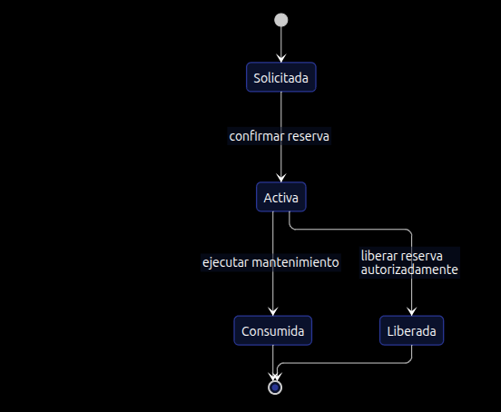
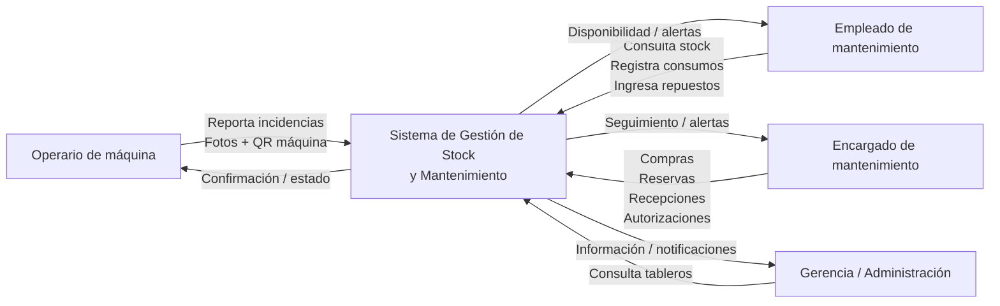
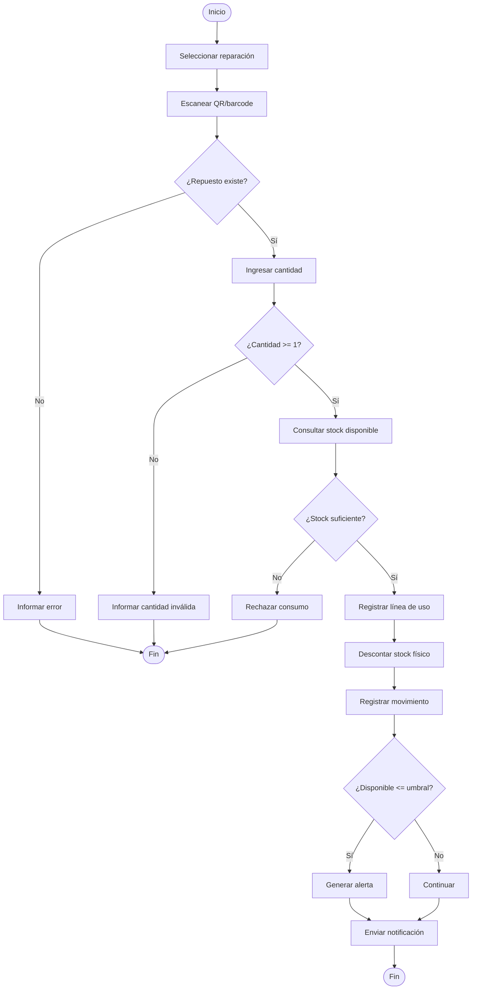
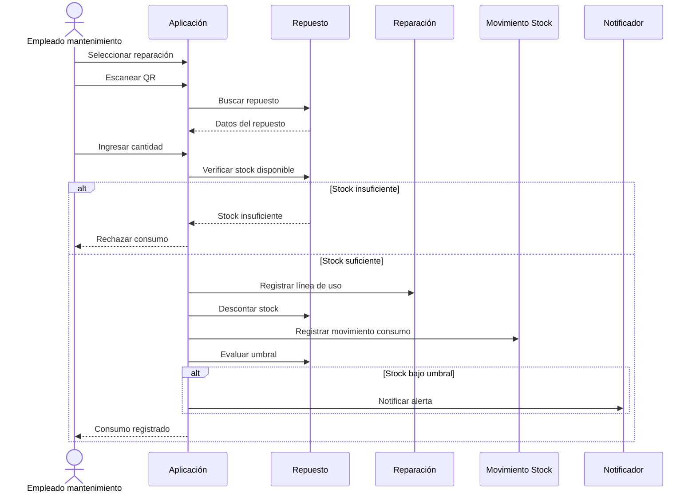

---

# M1 — Documentación funcional + planificación

## 1. Alcance del sistema

El sistema permitirá gestionar el stock de repuestos e insumos de una planta farmacéutica, relacionando los repuestos con máquinas, incidencias, reparaciones, pedidos de compra y mantenimientos preventivos.

Los procesos principales serán:

* Registrar máquinas.
* Consultar repuestos y stock.
* Registrar ingreso de repuestos.
* Registrar uso de repuestos en reparaciones.
* Reportar incidencias.
* Gestionar pedidos de compra.
* Reservar repuestos para mantenimientos preventivos.
* Liberar reservas autorizadamente.
* Ejecutar mantenimientos preventivos.
* Consultar trazabilidad.
* Generar alertas por stock bajo.
* Notificar eventos por correo.

La lista de compras **no será una entidad persistida**, sino una vista derivada de repuestos bajo umbral y requerimientos manuales. 

---

# 2. Actores

| Actor                      | Responsabilidades                                        |
| -------------------------- | -------------------------------------------------------- |
| Operario de máquina        | Reportar incidencias y solicitar reparaciones            |
| Empleado de mantenimiento  | Consultar stock, ingresar repuestos y registrar consumos |
| Encargado de mantenimiento | Gestionar compras, recepción, reservas y autorizaciones  |
| Gerencia / Administración  | Consultar tableros y recibir notificaciones              |

La Gerencia de Producción y Personal Administrativo se consideran un único rol de consulta por decisión de cátedra. 

---

# 3. Casos de uso


### CU-01 — Reportar incidencia

**Actor principal:** Operario de máquina.

Permite registrar un problema sobre una máquina, incluyendo fotos.

### CU-02 — Consultar disponibilidad de repuesto

**Actor principal:** Empleado de mantenimiento.

Permite buscar por:

* nombre
* descripción
* máquina
* código QR/barcode

Y visualizar:

* stock físico
* stock reservado
* stock disponible
* ubicación.

### CU-03 — Registrar uso de repuesto

**Actor principal:** Empleado de mantenimiento.

Registra los repuestos utilizados durante una reparación y descuenta el stock.

**Este será el CU principal de la M1.**

### CU-04 — Registrar recepción de compra

**Actor principal:** Encargado.

Carga el stock recibido y su ubicación.

### CU-05 — Generar pedido de compra

**Actor principal:** Empleado / Encargado.

Permite materializar una necesidad de reposición.

### CU-06 — Reservar repuestos

**Actor principal:** Encargado de mantenimiento.

Aparta repuestos para un mantenimiento preventivo.

### CU-07 — Liberar reserva

**Actor principal:** Encargado.

Libera una reserva y notifica el impacto producido.

### CU-08 — Ejecutar mantenimiento preventivo

**Actor principal:** Empleado de mantenimiento.

Consume los repuestos reservados y libera la reserva en la misma transacción.

### CU-09 — Registrar máquina

**Actor principal:** Encargado.

Registra una nueva máquina y genera la lista de repuestos asociados.

### CU-10 — Consultar trazabilidad

**Actor principal:** Encargado / Gerencia.

Permite reconstruir la historia del repuesto.

---

# 4. CU principal — Registrar uso de repuesto

## CU-03 — Registrar uso de repuesto en reparación

**Actor principal:** Empleado de mantenimiento.

**Objetivo:** Registrar el consumo de uno o más repuestos utilizados durante una reparación y actualizar el stock físico.

### Precondiciones

1. El usuario está autenticado.
2. El usuario posee rol **Empleado de mantenimiento**.
3. Existe una reparación/incidencia asociada.
4. El repuesto existe.
5. La cantidad solicitada es mayor o igual a 1.

### Postcondiciones

**Éxito:**

* Se registra una línea de uso.
* Se descuenta la cantidad utilizada del stock físico.
* Se registra un movimiento de stock.
* Se actualiza la disponibilidad.
* Si la disponibilidad queda por debajo o igual al umbral, se genera una alerta.
* Se registra el evento para trazabilidad.
* Se envía una notificación.

Esto deriva directamente de RN-01, RN-02 y RN-09. 

---

## Escenario principal

1. El empleado ingresa al sistema.
2. Selecciona una reparación.
3. Selecciona **Registrar uso de repuesto**.
4. Escanea el QR/barcode del repuesto.
5. El sistema identifica el repuesto.
6. El empleado ingresa la cantidad utilizada.
7. El sistema consulta el stock disponible.
8. El sistema verifica que la cantidad pueda ser descontada.
9. El sistema registra la línea de uso.
10. El sistema descuenta la cantidad del stock físico.
11. El sistema registra el movimiento de stock como `consumo`.
12. El sistema recalcula el stock disponible.
13. El sistema verifica el umbral mínimo.
14. Si corresponde, genera una alerta.
15. El sistema registra el evento para trazabilidad.
16. El sistema envía la notificación.
17. El caso de uso finaliza correctamente.

---

## Alternativos

### A1 — Repuesto reservado

En el paso 7, si el repuesto posee unidades reservadas, el sistema considera únicamente:

**Stock disponible = Stock físico − Stock reservado**

Si la cantidad solicitada supera el stock disponible, el uso no puede realizarse normalmente.

La liberación de una reserva requiere autorización de un Encargado. **RN-05**. 

### A2 — Stock queda bajo umbral

Luego del descuento:

```text
stock disponible <= umbral mínimo
```

El sistema:

1. genera la alerta;
2. incorpora el repuesto a la lista de compras;
3. envía la notificación correspondiente.

**RN-02.**

---

## Excepciones

### E1 — Stock insuficiente

Si:

```text
cantidad utilizada > stock disponible
```

el sistema:

* rechaza el consumo;
* no modifica el stock;
* no registra la línea de uso.

Se informa al empleado que no existe disponibilidad suficiente.

**RN-01.**

### E2 — Repuesto inexistente

Si el QR/barcode no corresponde a un repuesto registrado:

* se rechaza la operación;
* no se modifica stock;
* se informa el error.

### E3 — Cantidad inválida

Si:

```text
cantidad < 1
```

se rechaza la operación.

---

## Reglas de negocio involucradas

| Regla     | Aplicación                 |
| --------- | -------------------------- |
| **RN-01** | Descuento por uso          |
| **RN-02** | Control del umbral         |
| **RN-05** | Restricción sobre reservas |
| **RN-06** | Trazabilidad               |
| **RN-09** | Notificación               |

La cantidad de cada línea de uso es `≥ 1`, decisión que la cátedra ya dejó resuelta. 

---

# 5. Máquina de estados — Incidencia

Este es uno de los huecos deliberados que la M1 exige modelar. La cátedra explícitamente deja sin definir los estados de Incidencia, Reserva, Pedido y Máquina. 


### Estados

| Estado          | Significado                          |
| --------------- | ------------------------------------ |
| `REPORTADA`     | La incidencia fue registrada         |
| `EN_TRIAGE`     | Está siendo evaluada                 |
| `EN_REPARACION` | Se está realizando el trabajo        |
| `RESUELTA`      | El problema fue solucionado          |
| `CERRADA`       | La resolución fue confirmada         |
| `RECHAZADA`     | La incidencia no requiere reparación |

### Transiciones importantes

```
REPORTADA → EN_TRIAGE
EN_TRIAGE → EN_REPARACION
EN_TRIAGE → RECHAZADA
EN_REPARACION → RESUELTA
RESUELTA → CERRADA
```

---

# 6. Máquina de estados — Reserva

La reserva tiene una característica importante: **no es simplemente "reservado/liberado"**, porque también debe contemplarse su consumo cuando se ejecuta el mantenimiento.


### Estados

| Estado       | Descripción                       |
| ------------ | --------------------------------- |
| `SOLICITADA` | Se solicitó una reserva           |
| `ACTIVA`     | Las unidades están apartadas      |
| `LIBERADA`   | La reserva fue cancelada/liberada |
| `CONSUMIDA`  | Los repuestos fueron utilizados   |



debe realizarse en **la misma transacción**.

**RN-10.** 

---

# 7. Máquina de estados — Pedido de compra


### Estados

| Estado      | Significado                       |
| ----------- | --------------------------------- |
| `GENERADO`  | Pedido creado                     |
| `ENVIADO`   | Pedido notificado                 |
| `PARCIAL`   | Se recibió parte de lo solicitado |
| `RECIBIDO`  | Se recibió la totalidad           |
| `CERRADO`   | Pedido finalizado                 |
| `CANCELADO` | Pedido cancelado                  |

La urgencia solamente puede ser:

```text
NORMAL
URGENTE
```

según la decisión de cátedra. 

---

# 8. Máquina de estados — Máquina

Aunque la consigna destaca Incidencia, Reserva y Pedido, la sección 7 también pide resolver el estado de Máquina. 


Estados:

```text
OPERATIVA
EN_MANTENIMIENTO
FUERA_DE_SERVICIO
BAJA
```

---

# 9. Diagrama contextual

El sistema queda en el centro y los cuatro actores interactúan con él.



---

# 10. Diagrama de actividad — Registrar uso



---

# 11. Diagrama de secuencia — Registrar uso



---

# 12. Arquitectura multicapa

Para este proyecto recomiendo una arquitectura **multicapa con separación por responsabilidades**, incorporando puertos/adaptadores para las dependencias externas.

```text
┌──────────────────────────────────────┐
│          PRESENTACIÓN                │
│ Web  / API                   │
└──────────────────┬───────────────────┘
                   ↓
┌──────────────────────────────────────┐
│        APLICACIÓN / CASOS DE USO     │
│ CU-01 ... CU-10                      │
└──────────────────┬───────────────────┘
                   ↓
┌──────────────────────────────────────┐
│             DOMINIO                  │
│ Entidades                            │
│ Reglas de negocio                    │
│ Máquinas de estado                   │
│ RN-01 ... RN-10                      │
└──────────────────┬───────────────────┘
                   ↓
┌──────────────────────────────────────┐
│       INFRAESTRUCTURA                │
│ Persistencia                         │
│ Notificaciones                       │
│ QR / Barcode                         │
│ Cámara / archivos                    │
└──────────────────────────────────────┘
```

El dominio queda independiente de:

* base de datos;
* correo;
* interfaz web;
* cámara;
* servicios externos.

Esto encaja especialmente bien con la decisión de implementar RN-09 mediante un **puerto de notificación y un adaptador falso**, por ejemplo Log/Mailhog. 

---

# 13. ADR-001 — Arquitectura multicapa

## Contexto

El sistema debe ser reutilizable, escalable y mantener separadas las responsabilidades.

Además, la cátedra exige arquitectura multicapa. 

## Decisión

Adoptar arquitectura multicapa:

1. Presentación.
2. Aplicación.
3. Dominio.
4. Infraestructura.

## Consecuencias

### Positivas

* Separación de responsabilidades.
* Facilita testing.
* Permite cambiar la interfaz.
* Permite cambiar infraestructura.
* Facilita evolución del sistema.

### Negativas

* Mayor cantidad de clases/interfaces.
* Mayor complejidad inicial.
* Requiere disciplina para mantener las dependencias correctamente.

---

# 14. ADR-002 — Notificaciones

## Contexto

RN-09 exige enviar notificaciones por correo, pero la implementación de correo real puede introducir complejidad innecesaria.

El propio dominio indica utilizar un puerto de notificación y un adaptador falso. 

## Decisión

Crear:

```text
Notificador
    ↓
AdaptadorMailhog / FakeNotifier
```

El dominio solamente conocerá la abstracción:

```text
Notificador.enviar(...)
```

## Consecuencia

Se puede reemplazar posteriormente Mailhog/FakeNotifier por un proveedor real sin modificar las reglas del dominio.

---

# 15. ADR-003 — Persistencia de lista de compras

## Contexto

La lista de compras podría modelarse como una entidad, pero la cátedra decidió explícitamente que es una vista derivada.

## Decisión

**No persistir Lista de compras.**

Se obtiene mediante:

```text
Repuestos donde
stockDisponible <= umbralMinimo
+
requerimientos manuales
```

El Pedido de compra sí será persistido.

Esta decisión está explícitamente establecida por la cátedra. 

---

# 16. ADR-004 — Concurrencia del stock

Este ADR puede quedar preparado para M4, porque el dominio indica expresamente que la decisión de concurrencia se realizará allí. 

## Problema

Dos empleados podrían intentar consumir simultáneamente la última unidad:

```text
Stock = 1

Empleado A → consume 1
Empleado B → consume 1
```

## Decisión para M4

Evaluar:

* `CHECK` a nivel de base de datos;
* `SELECT FOR UPDATE`;
* versionado optimista.

**No cerrar esta decisión en M1**, porque el propio dominio la reserva para M4.

---

# 17. Planificación

Para el tablero pueden crear las siguientes issues.

| Issue | Tarea                                 | Estimación |
| ----- | ------------------------------------- | ---------: |
| #1    | Documentar actores y alcance          |        2 h |
| #2    | Modelar estados de Incidencia         |        2 h |
| #3    | Modelar estados de Reserva            |        2 h |
| #4    | Modelar estados de Pedido             |        2 h |
| #5    | Modelar estado de Máquina             |      1,5 h |
| #6    | Especificar CU-01 Reportar incidencia |        2 h |
| #7    | Especificar CU-03 Registrar uso       |        3 h |
| #8    | Especificar CU-04 Recepción de compra |        2 h |
| #9    | Especificar CU-06 Reservar repuestos  |        2 h |
| #10   | Diagrama contextual                   |      1,5 h |
| #11   | Diagrama actividad CU principal       |        2 h |
| #12   | Diagrama secuencia CU principal       |        2 h |
| #13   | ADR arquitectura                      |        2 h |
| #14   | ADR notificaciones                    |        1 h |
| #15   | ADR lista de compras                  |        1 h |
| #16   | Preparar README/documentación M1      |        2 h |
| #17   | Revisión cruzada                      |        2 h |

**Total aproximado: 32 horas.**


## Lo más importante para defender la M1

Si tienen que explicarla oralmente, yo remarcaría estas **5 decisiones**:

1. **El CU principal es registrar el uso de repuestos**, porque es el proceso que impacta directamente sobre el stock.
2. **Stock disponible no es stock físico**:

   ```text
   disponible = físico - reservado
   ```


3. **La lista de compras no se persiste**; se deriva del estado del stock.
4. **Las máquinas de estado son decisiones de modelado del grupo**, porque la sección 7 deliberadamente no las define.
5. **La concurrencia del descuento no se resuelve todavía**: queda para M4, tal como exige el dominio.
